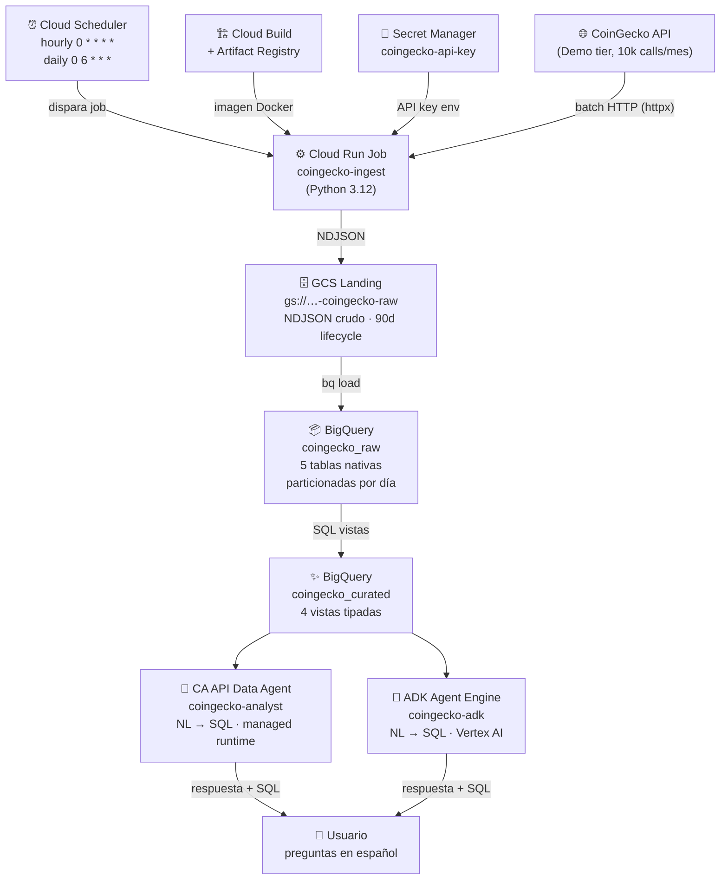
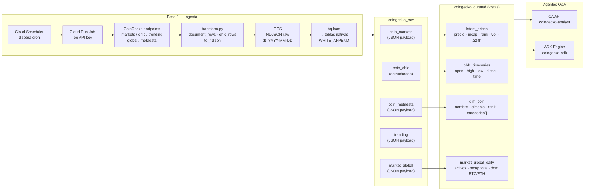
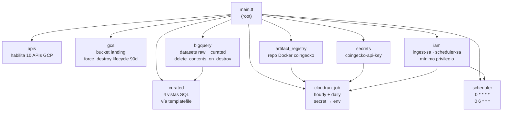
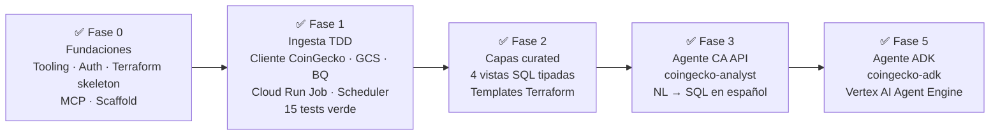

# gcp-agent-mvp

Pipeline **CoinGecko → BigQuery → Agente Q&A en lenguaje natural** construido sobre Google Cloud Platform.

Proyecto MVP end-to-end: ingesta batch de datos de mercado cripto, arquitectura medallion en BigQuery (raw → curated) y dos agentes Gemini/Vertex nativos para preguntas en lenguaje natural.

---

## Arquitectura general



---

## Stack tecnológico

| Capa | Tecnología | Por qué |
|---|---|---|
| Ingesta | Cloud Run Job + Python (httpx, tenacity) | Serverless, escala a cero, retry automático |
| Orquestación | Cloud Scheduler (cron) | Batch sencillo, sin Airflow |
| Secretos | Secret Manager | API key nunca en código/env repo |
| Landing | GCS (NDJSON) | Replay sin re-llamar CoinGecko, audit trail |
| Build | Cloud Build + Artifact Registry | Sin Docker local (Windows) |
| Almacén | BigQuery raw + curated | Analytics serverless, escalable |
| Agente 1 | Conversational Analytics API | NL→SQL nativo, zero infra propia |
| Agente 2 | ADK + Vertex AI Agent Engine | Extensible, multi-tool, productivo |
| IaC | Terraform | Reproducible, `apply` / `destroy` limpio |
| Dev | MCP BigQuery Toolbox | Inspección de esquemas y queries en dev |

---

## Flujo de datos paso a paso



---

## Estructura del repositorio

```
gcp-agent-mvp/
├── infra/terraform/          # IaC — un solo apply/destroy
│   ├── main.tf               # módulos llamados
│   ├── variables.tf
│   ├── providers.tf
│   └── modules/
│       ├── apis/             # habilita las 10 APIs GCP
│       ├── gcs/              # bucket landing (NDJSON)
│       ├── bigquery/         # datasets + 5 tablas raw
│       ├── curated/          # 4 vistas curated (templatefile SQL)
│       ├── artifact_registry/# repo Docker
│       ├── secrets/          # Secret Manager (API key)
│       ├── iam/              # service accounts + roles mínimos
│       ├── cloudrun_job/     # 2 jobs (hourly + daily)
│       └── scheduler/        # 2 triggers cron
├── ingestion/                # Python package + Dockerfile
│   └── src/coingecko_mvp/
│       ├── config.py         # settings desde env
│       ├── client.py         # CoinGeckoClient (httpx + tenacity)
│       ├── transform.py      # normalización → NDJSON
│       ├── gcs_writer.py     # sube NDJSON a GCS
│       ├── bq_loader.py      # bq load GCS → BigQuery
│       └── main.py           # orquestador (hourly|daily|all)
├── transform/sql/            # SQL de las vistas curated
├── agent/                    # CA API Data Agent (coingecko-analyst)
│   └── src/coingecko_agent/
│       ├── config.py
│       ├── create_agent.py
│       └── ask.py
├── adk_agent/                # ADK + Agent Engine
│   └── src/coingecko_adk/
│       ├── agent.py          # root_agent + BigQueryToolset
│       ├── deploy.py
│       └── query_remote.py
├── docs/
│   ├── architecture.md
│   ├── decisions/ADR-0001-stack.md
│   └── phases/               # write-up por fase (00…05)
└── .mcp.json                 # MCP BigQuery Toolbox (dev)
```

---

## Módulos Terraform



---

## Fases del proyecto



---

## Guía de replicación paso a paso

### Prerrequisitos

- Cuenta GCP con billing habilitado
- `gcloud` SDK instalado
- `terraform` ≥ 1.5
- `python` 3.12 + `uv`
- API key gratuita de [CoinGecko Demo](https://www.coingecko.com/en/api)
- `git`

> En Windows: no necesitas Docker — la imagen se construye en Cloud Build.

---

### Paso 1 — Clonar y autenticar

```bash
git clone https://github.com/danzstorm/gcp-agent-mvp.git
cd gcp-agent-mvp

# Auth GCP (interactivo)
gcloud auth login
gcloud auth application-default login
gcloud config set project TU_PROJECT_ID
gcloud auth application-default set-quota-project TU_PROJECT_ID
```

---

### Paso 2 — Configurar variables Terraform

```bash
cp infra/terraform/terraform.tfvars.example infra/terraform/terraform.tfvars
```

Editar `terraform.tfvars`:

```hcl
project_id          = "TU_PROJECT_ID"
region              = "us-central1"
bq_location         = "US"
landing_bucket_name = "TU_PROJECT_ID-coingecko-raw"
```

---

### Paso 3 — Aplicar infraestructura base

```bash
cd infra/terraform
terraform init
terraform plan
terraform apply   # ~14 recursos: APIs, GCS, BQ, Secret, IAM, Artifact Registry
```

Esto habilita las 10 APIs GCP necesarias, crea el bucket GCS, los datasets BigQuery y el Secret Manager vacío.

---

### Paso 4 — Cargar la API key de CoinGecko

```bash
# En Linux/Mac:
echo -n "TU_API_KEY_COINGECKO" | \
  gcloud secrets versions add coingecko-api-key --data-file=-

# En Windows PowerShell:
"TU_API_KEY_COINGECKO" | `
  gcloud secrets versions add coingecko-api-key --data-file=-
```

Validar:

```bash
gcloud secrets versions access latest --secret=coingecko-api-key
```

---

### Paso 5 — Construir imagen Docker (sin Docker local)

```bash
gcloud builds submit ingestion \
  --tag us-central1-docker.pkg.dev/TU_PROJECT_ID/coingecko/ingest:latest
```

Cloud Build toma el `Dockerfile` de `ingestion/` y sube la imagen a Artifact Registry.

---

### Paso 6 — Desplegar Cloud Run Jobs + Scheduler

```bash
cd infra/terraform
terraform apply   # aplica cloudrun_job + scheduler (dependen de la imagen)
```

Esto crea:
- `coingecko-ingest-hourly` — dispara cada hora (`0 * * * *`)
- `coingecko-ingest-daily` — dispara a las 6 UTC (`0 6 * * *`, OHLC top 50)

---

### Paso 7 — Ejecutar primer job y verificar datos

```bash
# Disparo manual
gcloud run jobs execute coingecko-ingest-hourly --region us-central1

# Ver logs
gcloud run jobs executions list --job coingecko-ingest-hourly --region us-central1

# Verificar datos en BigQuery
bq query --use_legacy_sql=false \
  "SELECT coin_id, JSON_VALUE(payload, '$.current_price') AS price
   FROM coingecko_raw.coin_markets
   ORDER BY ingestion_time DESC LIMIT 5"
```

---

### Paso 8 — Tests de la ingesta

```bash
cd ingestion
uv run pytest        # debe pasar 15/15
```

---

### Paso 9 — Vistas curated (ya incluidas en Terraform)

Las 4 vistas de `coingecko_curated` se crean con el `terraform apply` del módulo `curated`. Verificar:

```bash
bq query --use_legacy_sql=false \
  "SELECT coin_id, current_price_usd, market_cap_rank
   FROM coingecko_curated.latest_prices
   ORDER BY market_cap_rank LIMIT 10"
```

---

### Paso 10 — Crear el Data Agent (CA API)

```bash
cd agent
export GCP_PROJECT=TU_PROJECT_ID
export PYTHONUTF8=1

uv run python -m coingecko_agent.create_agent
```

Esto registra el Data Agent `coingecko-analyst` apuntando a las 4 vistas curated.

---

### Paso 11 — Hacer preguntas al agente

```bash
# CA API Data Agent
cd agent
uv run python -m coingecko_agent.ask "¿Top 5 monedas por market cap?"
uv run python -m coingecko_agent.ask "¿Cómo fue el OHLC de bitcoin la última semana?"
uv run python -m coingecko_agent.ask "¿Qué categorías dominan por número de monedas?"
uv run python -m coingecko_agent.ask "¿Cuál es la dominancia de BTC hoy?"
uv run python -m coingecko_agent.ask "¿Qué monedas están trending?"
```

---

### Paso 12 (opcional) — Desplegar ADK Agent Engine

```bash
cd adk_agent
export GOOGLE_GENAI_USE_VERTEXAI=TRUE
export GOOGLE_CLOUD_PROJECT=TU_PROJECT_ID
export GOOGLE_CLOUD_LOCATION=us-central1
export GCP_PROJECT=TU_PROJECT_ID
export PYTHONUTF8=1

# Requiere bucket staging GCS adicional
gcloud storage buckets create gs://TU_PROJECT_ID-agent-staging --location=us-central1

uv run python deploy.py   # ~5-10 min, imprime RESOURCE_NAME

# Consultar el agente desplegado
export AGENT_ENGINE_RESOURCE=<RESOURCE_NAME_del_output>
uv run python query_remote.py "¿Top 5 por market cap?"
```

También se puede probar desde la consola GCP:  
**Vertex AI → Agent Engine → coingecko-adk → Test agent**

---

### Teardown limpio

```bash
cd infra/terraform
terraform destroy   # elimina todos los recursos, incluso BQ con datos
```

> El bucket GCS tiene `force_destroy = true` y los datasets BQ tienen `delete_contents_on_destroy = true` — el destroy funciona aunque haya datos.

---

## Comparativa de agentes

| | CA API (`agent/`) | ADK Engine (`adk_agent/`) |
|---|---|---|
| Producto | Conversational Analytics API | ADK + Vertex AI Agent Engine |
| Runtime | Managed por BigQuery/Google | Reasoning Engine (Vertex AI) |
| Consola | BigQuery Studio | Vertex AI → Agent Engine |
| Extensible | Solo datos BQ | Multi-tool, código Python propio |
| CLI | `uv run python -m coingecko_agent.ask "…"` | `uv run python query_remote.py "…"` |
| Ideal para | Analytics puro, setup rápido | Agentes productivos y extensibles |

---

## Presupuesto de API (CoinGecko Demo — 100 calls/min, 10k/mes)

| Cadencia | Endpoints | Calls/mes |
|---|---|---|
| Hourly (3 calls × 24h × 30d) | markets + global + trending | ~2 160 |
| Daily (top-50 OHLC + metadata) | ohlc + coin | ~3 000 |
| **Total** | | **~5 160 < 10 000** ✅ |

Holgura del ~48% para reintentos y desarrollo.

---

## Seguridad

- Ninguna credencial en el repo (`.gitignore` cubre `*.tfvars`, `*.json` service accounts, `.env`)
- API key CoinGecko: solo en Secret Manager, inyectada como env al job en runtime
- Auth GCP: Application Default Credentials (`gcloud auth application-default login`)
- IAM mínimo privilegio: `ingest-sa` solo puede leer el secret, escribir en GCS y cargar a BQ

---

## Requisitos locales

| Herramienta | Versión probada |
|---|---|
| gcloud SDK | 574+ |
| Terraform | 1.15.7 |
| Python | 3.12.8 |
| uv | 0.11.6 |
| git | 2.52 |

> Tras instalar gcloud o Terraform en Windows, reiniciar la terminal para refrescar el PATH.
